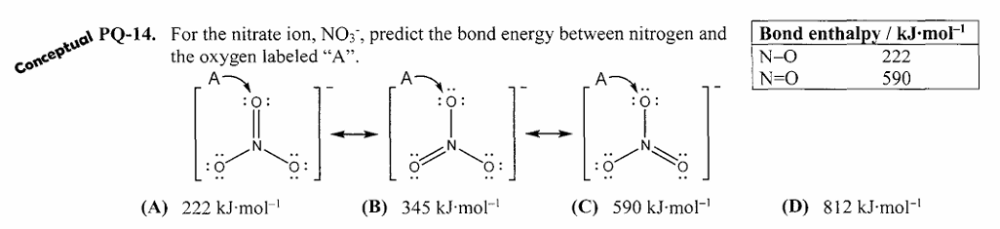

```{r setup, include=FALSE}
knitr::opts_chunk$set(echo = TRUE)
```

<style>
/* Overall font */
body { font-size: 16px; line-height: 1.7; }

/* Question boxes */
.question-box {
  background-color: #eef4fb;
  border-left: 5px solid #2c7bb6;
  padding: 15px 20px;
  border-radius: 5px;
  margin: 20px 0 10px 0;
  font-size: 16px;
}

/* Hint boxes */
.hint-box {
  background-color: #fff8e1;
  border-left: 5px solid #f9a825;
  padding: 12px 18px;
  border-radius: 5px;
  margin: 10px 0;
}

/* Answer boxes */
.answer-box {
  background-color: #e8f5e9;
  border-left: 5px solid #388e3c;
  padding: 12px 18px;
  border-radius: 5px;
  margin: 10px 0;
}

/* Topic headers */
h1 { color: #1a5276; border-bottom: 2px solid #2c7bb6; padding-bottom: 6px; }
h2 { color: #1f618d; margin-top: 40px; }
h3 { color: #2874a6; }

/* Answer label */
.answer-label {
  font-weight: bold;
  color: #1e8449;
  margin-bottom: 6px;
}

/* Correct answer highlight */
.correct { color: #1e8449; font-weight: bold; }

/* Instructions banner */
.instructions {
  background-color: #f4f6f7;
  border: 1px solid #ccc;
  padding: 14px 20px;
  border-radius: 6px;
  margin-bottom: 30px;
}
</style>

---

<div class="instructions">
**How to use this review sheet:**

1. Read each question carefully and **write down your setup on paper** before clicking anything.
2. If you want a nudge, click **"Show Hint"** to see a strategy tip.
3. Once you've attempted the problem, click **"Show Solution"** to reveal the full worked answer.
4. The correct answer choice is marked in **<span class="correct">green</span>**.
</div>

---

# **Topic 1: Atomic Structure & Periodicity**

---

### Question 1

<div class="question-box">

Which of the following elements has the largest first ionization energy?

(A) Na  &nbsp;&nbsp; (B) Mg  &nbsp;&nbsp; (C) Al  &nbsp;&nbsp; (D) Si

</div>

**Try it yourself — write your setup on paper before revealing the hint or solution.**

```{r hint-1, class.source="hint-box"}
# --- HINT (click "Show" to reveal) ---
# Think about the trend for ionization energy across a period.
# Which direction does IE increase as you move left → right?
# Are there any exceptions you need to remember?
```

```{r solution-1, class.source="answer-box"}
# --- SOLUTION (click "Show" to reveal) ---
# 
# Strategy: Ionization energy INCREASES left → right across a period
# and DECREASES top → bottom down a group.
#
# All four options (Na, Mg, Al, Si) are in Period 3.
# Moving left → right: Na < Mg < Al < Si in general trend.
#
# Note: There IS an exception between Mg and Al
# (Al drops slightly because it loses a 3p electron vs Mg's 3s),
# but Si is still higher than all of these.
#
# Correct answer: (D) Si
```

<p class="correct">✓ Correct Answer: (D) Si</p>

---

### Question 2

<div class="question-box">
How many protons, neutrons, and electrons are in the ion $^{37}_{17}\text{Cl}^-$?

(A) 17p, 20n, 17e &nbsp;&nbsp; (B) 17p, 20n, 18e &nbsp;&nbsp; (C) 20p, 17n, 18e &nbsp;&nbsp; (D) 17p, 17n, 18e
</div>

**Try it yourself first!**

```{r hint-2, class.source="hint-box"}
# --- HINT ---
# The bottom number in isotope notation is the atomic number (= protons).
# Mass number = protons + neutrons, so neutrons = mass - protons.
# The charge tells you about electrons: negative charge means gained electrons.
```

```{r solution-2, class.source="answer-box"}
# --- SOLUTION ---
#
# Isotope notation: mass number on top (37), atomic number on bottom (17)
#
# Protons   = atomic number = 17
# Neutrons  = mass number - protons = 37 - 17 = 20
# Electrons = protons + charge = 17 + 1 = 18
#             (Cl⁻ has gained 1 electron, so negative charge)
#
# Correct answer: (B) 17p, 20n, 18e
```

<p class="correct">✓ Correct Answer: (B) 17p, 20n, 18e</p>

---

# **Topic 2: Stoichiometry & the Mole**

---

### Question 3

<div class="question-box">
How many grams of $\text{CO}_2$ are produced when 44.0 g of propane ($\text{C}_3\text{H}_8$) is completely combusted?

$$\text{C}_3\text{H}_8 + 5\text{O}_2 \rightarrow 3\text{CO}_2 + 4\text{H}_2\text{O}$$

(A) 44.0 g &nbsp;&nbsp; (B) 88.0 g &nbsp;&nbsp; (C) 132.0 g &nbsp;&nbsp; (D) 176.0 g
</div>


```{r hint-3, class.source="hint-box"}
# --- HINT ---
# Step 1: Convert grams of C₃H₈ → moles of C₃H₈  (need molar mass of C₃H₈)
# Step 2: Use the mole ratio from the balanced equation to get moles of CO₂
# Step 3: Convert moles of CO₂ → grams of CO₂  (need molar mass of CO₂)
#
# Molar mass of C₃H₈  =  3(12) + 8(1)  =  44.0 g/mol
# Molar mass of CO₂   =  12 + 2(16)    =  44.0 g/mol
```

```{r solution-3, class.source="answer-box"}
# --- SOLUTION ---
#
# Molar mass C₃H₈ = 3(12.01) + 8(1.008) = 44.09 g/mol  ≈ 44.0 g/mol
# Molar mass CO₂  = 12.01 + 2(16.00)    = 44.01 g/mol  ≈ 44.0 g/mol
#
# Step 1: moles of C₃H₈
#   44.0 g ÷ 44.0 g/mol = 1.00 mol C₃H₈
#
# Step 2: mole ratio (from balanced equation)
#   1 mol C₃H₈ produces 3 mol CO₂
#   1.00 mol × (3 mol CO₂ / 1 mol C₃H₈) = 3.00 mol CO₂
#
# Step 3: grams of CO₂
#   3.00 mol × 44.0 g/mol = 132.0 g CO₂
#
# Correct answer: (C) 132.0 g
```

<p class="correct">✓ Correct Answer: (C) 132.0 g</p>

---

# **Topic 3: Solutions & Concentration**

---

### Question 4

<div class="question-box">
What volume of a 2.00 M NaCl solution is needed to prepare 100.0 mL of a 0.500 M NaCl solution?

(A) 10.0 mL &nbsp;&nbsp; (B) 25.0 mL &nbsp;&nbsp; (C) 40.0 mL &nbsp;&nbsp; (D) 50.0 mL
</div>

**What equation connects these four quantities?**

```{r hint-4, class.source="hint-box"}
# --- HINT ---
# Use the dilution equation:
#   M₁V₁ = M₂V₂
# where subscript 1 = concentrated (stock) solution
#       subscript 2 = diluted (final) solution
# Solve for V₁.
```

```{r solution-4, class.source="answer-box"}
# --- SOLUTION ---
#
# Dilution equation:  M₁V₁ = M₂V₂
#
# Known:
#   M₁ = 2.00 M   (stock)
#   M₂ = 0.500 M  (final)
#   V₂ = 100.0 mL (final volume)
#   V₁ = ?
#
# Solving:
#   V₁ = (M₂ × V₂) / M₁
#   V₁ = (0.500 M × 100.0 mL) / 2.00 M
#   V₁ = 25.0 mL
#
# Procedure: measure 25.0 mL of 2.00 M stock,
# then add water until total volume = 100.0 mL.
#
# Correct answer: (B) 25.0 mL
```

<p class="correct">✓ Correct Answer: (B) 25.0 mL</p>

---

# **Topic 4: Thermochemistry**

---

### Question 5

<div class="question-box">
Given the following data:

$$\text{C}(s) + \text{O}_2(g) \rightarrow \text{CO}_2(g) \quad \Delta H = -393.5 \text{ kJ/mol}$$
$$\text{H}_2(g) + \frac{1}{2}\text{O}_2(g) \rightarrow \text{H}_2\text{O}(l) \quad \Delta H = -285.8 \text{ kJ/mol}$$
$$\text{C}_2\text{H}_5\text{OH}(l) + 3\text{O}_2(g) \rightarrow 2\text{CO}_2(g) + 3\text{H}_2\text{O}(l) \quad \Delta H = -1366.8 \text{ kJ/mol}$$

What is $\Delta H_{f}^\circ$ for ethanol, $\text{C}_2\text{H}_5\text{OH}(l)$?

(A) +277.0 kJ/mol &nbsp;&nbsp; (B) -277.0 kJ/mol &nbsp;&nbsp; (C) -687.5 kJ/mol &nbsp;&nbsp; (D) +1366.8 kJ/mol
</div>

**This is a Hess's Law problem. Write out what you need to form 1 mol of ethanol from elements.**

```{r hint-5, class.source="hint-box"}
# --- HINT ---
# The target equation is:  2C(s) + 3H₂(g) + ½O₂(g) → C₂H₅OH(l)
#
# Use Hess's Law — manipulate the given equations to add up to the target:
#   - Multiply equation 1 by 2  (need 2 CO₂)
#   - Multiply equation 2 by 3  (need 3 H₂O)
#   - REVERSE equation 3        (need ethanol as product, not reactant)
#
# Remember: reversing a reaction flips the sign of ΔH.
```

```{r solution-5, class.source="answer-box"}
# --- SOLUTION ---
#
# Target: 2C(s) + 3H₂(g) + ½O₂(g) → C₂H₅OH(l)   ΔHf° = ?
#
# Step 1: ×2 eq.1   2C + 2O₂ → 2CO₂           ΔH = 2(-393.5) = -787.0 kJ
# Step 2: ×3 eq.2   3H₂ + 3/2 O₂ → 3H₂O       ΔH = 3(-285.8) = -857.4 kJ
# Step 3: REVERSE eq.3
#                   2CO₂ + 3H₂O → C₂H₅OH + 3O₂  ΔH = +1366.8 kJ
#
# Add all three:
#   ΔHf° = -787.0 + (-857.4) + 1366.8
#   ΔHf° = -277.6 kJ/mol  ≈  -277.0 kJ/mol
#
# (The CO₂, H₂O, and most O₂ cancel out across the three equations)
#
# Correct answer: (B) -277.0 kJ/mol
```

<p class="correct">✓ Correct Answer: (B) -277.0 kJ/mol</p>

---

# **Topic 5: Gases**

---

### Question 6

<div class="question-box">
A sample of gas occupies 4.00 L at 300 K and 1.00 atm. What volume will it occupy at 600 K and 2.00 atm?

(A) 1.00 L &nbsp;&nbsp; (B) 4.00 L &nbsp;&nbsp; (C) 8.00 L &nbsp;&nbsp; (D) 16.0 L
</div>

**Write out your knowns and unknowns. Which gas law can you use?**

```{r hint-6, class.source="hint-box"}
# --- HINT ---
# Both T and P are changing, so use the Combined Gas Law:
#
#   (P₁V₁)/T₁ = (P₂V₂)/T₂
#
# Solve for V₂. Make sure temperature is in KELVIN (it already is here).
```

```{r solution-6, class.source="answer-box"}
# --- SOLUTION ---
#
# Combined Gas Law:  (P₁V₁)/T₁ = (P₂V₂)/T₂
#
# Known:
#   P₁ = 1.00 atm,  V₁ = 4.00 L,  T₁ = 300 K
#   P₂ = 2.00 atm,  V₂ = ?,       T₂ = 600 K
#
# Solve for V₂:
#   V₂ = (P₁V₁T₂) / (T₁P₂)
#   V₂ = (1.00 × 4.00 × 600) / (300 × 2.00)
#   V₂ = 2400 / 600
#   V₂ = 4.00 L
#
# Conceptual check:
#   Doubling T doubles volume (+) 
#   Doubling P halves volume  (-)
#   These two effects cancel → same volume!
#
# Correct answer: (B) 4.00 L
```

<p class="correct">✓ Correct Answer: (B) 4.00 L</p>

---

# **Topic 6: Bonding**

---

### Question 6

<div class="question-box">
{width=80%}

**Try it yourself first!**

```{r hint-N, class.source="hint-box"}
# --- HINT ---
# How many total bonds are there? How many double and triple bonds?
```

```{r solution-N, class.source="answer-box"}
# --- SOLUTION ---
# ((222)+1(590))/3 = 345 kJ/mol$
```

<p class="correct">✓ Correct Answer: (B) 345 kJ/mol</p>

---
````

*UVU Supplemental Instruction | General Chemistry 1*
